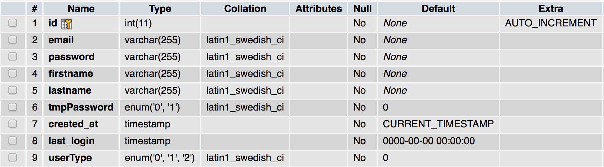
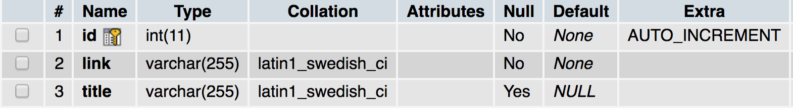
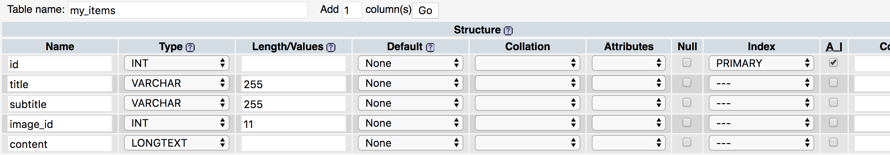
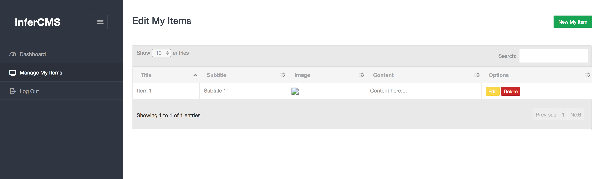

# InferCMS

InferCMS is a PHP content management system that uses MySQL column data types to generate models and administrative functionality.

This project started out as spaghetti code used for simple websites that stored data in MySQL databases, and over the last few years slowly started to morph into a basic content management system that is meant to be used as follows:
- Configure site
  - Connect to database in `/classes/DB.php`
  - Set sitewide variables in `/classes/init.php`
  - Set email account in `/classes/Email.php`
- Create `users` and `images` tables
    
    

    

- Set up custom models as MySQL table schema
    

- Create two PHP files for each model in `/classes` directory
  - Singular file (e.g. MyItem.php)
  - Plural file (e.g. MyItems.php)
- Use administrator portal to dynamically input content
  - `/admin/edit_all.php?model=myItems`
- Access content in frontend pages
  - Include `<?php require('path/to/classes/init.php'); ?>` to import all models
  - In PHP, access content through the plural model
    ```
    $all_items = MyItems::findAll();
    $all_items[0]->get('name');
    $all_items[0]->get('image1')->get('link');

    $single_item = MyItems::find(0);
    $single_item->get('name');
    $single_item->get('image2')->get('title');

    MyItems::delete(0);
    ```
    
### Administrator Portal Screenshots




